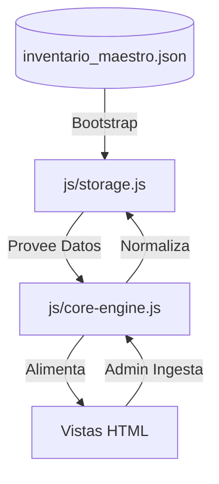

# Arquitectura y Stack Tecnológico

## 1. Stack de Tecnologías
El aplicativo se ha desarrollado bajo un enfoque **"Vanilla & Lightweight"** para garantizar portabilidad y rapidez sin dependencias de servidor (Local-first).

- **Frontend:** HTML5 Semántico y CSS3 Vanila (Diseño Premium con Variables CSS).
- **Lógica:** JavaScript ES6+ (Programación Orientada a Objetos - Core Engine).
- **Persistencia:** Browser LocalStorage con motor de sincronización asíncrona.
- **Librerías Externas:**
    - `JSZip.js`: Generación de archivos comprimidos en el lado del cliente.
    - `FileSaver.js`: Gestión de descargas de archivos.
    - `Google Fonts`: Tipografía Inter para legibilidad institucional.

## 2. Estructura de Archivos
| Ruta | Funcionalidad |
| :--- | :--- |
| `index.html` | Dashboard principal y configuración de IA. |
| `admin-ingesta.html` | Consola de carga masiva, validación y sanitización JSON. |
| `admin-directorios.html` | Generador de estructura de carpetas (Local/Cloud). |
| `inventario.html` | Visor jerárquico de procesos (Acordeones). |
| `js/core-engine.js` | **Cerebro del Sistema.** Centraliza la jerarquía y validación. |
| `js/storage.js` | Capa de persistencia y lógica de Auto-Bootstrap. |
| `js/ai-handler.js` | Puente de comunicación con modelos LLM (Gemini/LM Studio). |
| `datos/inventario_maestro.json` | **Fuente Única de Verdad.** Base de datos JSON maestra. |

## 3. Diagrama de Estructura (Mermaid)

