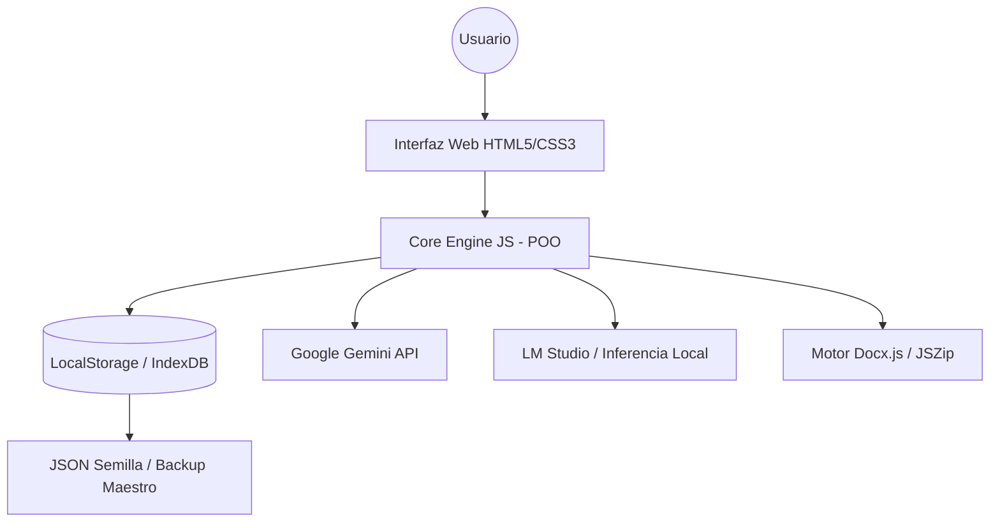

# Arquitectura y Stack Tecnológico: AGROIDEAS GxP

## 🗺️ Diagrama de Arquitectura General
El sistema opera bajo un modelo de **Soberanía de Datos Local**, donde el procesamiento y la persistencia ocurren íntegramente en el cliente (Browser), eliminando la dependencia de servidores externos y garantizando la privacidad institucional.

## 🛠️ Detalle del Stack Tecnológico
*   **Frontend:** 
    *   **Lenguajes:** HTML5 Semántico y CSS3 Vanila.
    *   **Metodología:** **BEM (Block Element Modifier)** para la escalabilidad de estilos.
    *   **Estética:** Diseño Premium basado en *Glassmorphism* y variables CSS dinámicas para el cumplimiento de la marca institucional.
*   **Backend (Client-Side Logic):** 
    *   **Lenguaje:** JavaScript ES6+ utilizando un enfoque de **Programación Orientada a Objetos (POO)**. 
    *   **Arquitectura:** El sistema no posee backend tradicional (PHP/Node); toda la lógica de negocio, validación GxP y persistencia reside en el motor del navegador.
*   **Herramientas Auxiliares:**
    *   **IA Brain PRO:** Motor de inteligencia con soporte dual para Google Gemini y LM Studio (vía OpenAI SDK Compatible).
    *   **Dependencias Críticas:** `Docx.js` (Generación de Word), `JSZip` (Estructuras de carpetas) y `FileSaver.js`.

## 📐 Patrones de Diseño y Convenciones
*   **Arquitectura Modular:** Lógica dividida en controladores desacoplados:
    *   `storage.js`: Gestión de persistencia y bootstrap.
    *   `core-engine.js`: Procesamiento de jerarquías y reglas de negocio.
    *   `ai-handler.js`: Orquestación de modelos LLM.
*   **Convenciones de Codificación:**
    *   Variables y funciones en `camelCase`.
    *   Nombres de Claves en LocalStorage en `UPPER_SNAKE_CASE`.
    *   Validación de integridad mediante regex institucional para códigos de proceso.

## 🚀 Entornos y Despliegue
*   **Desarrollo:** Local con soporte de *Live Server* para gestión de módulos ES6.
*   **Producción:** Despliegue estático. No requiere servidor de aplicaciones ni base de datos relacional. Puede ejecutarse desde una intranet local o servicios de hosting estático (GitHub Pages, Vercel, IIS).
*   **Requisitos:** Navegador moderno (Chrome/Edge/Firefox) con soporte para LocalStorage y Web Workers (para IA).
