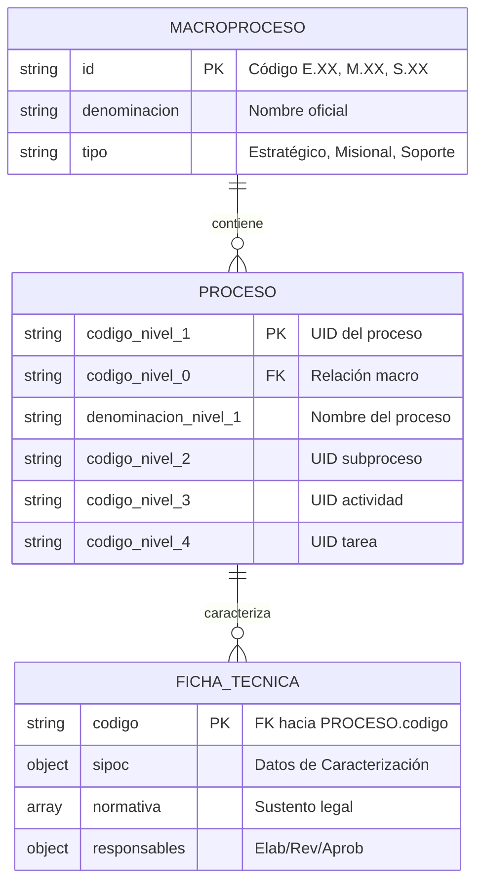

# Diccionario de Datos: AGROIDEAS GxP

## 📊 Diagrama Entidad-Relación (Lógico)
Dado que el sistema utiliza un modelo NoSQL jerárquico, las relaciones se establecen mediante anclajes de códigos (UIDs) institucionales.

## ⚙️ Motor y Estructura General
*   **Motor de Base de Datos:** `Web Storage API (LocalStorage)`.
*   **Formato de Intercambio:** JSON (JavaScript Object Notation).
*   **Estructura:** Colecciones de objetos indexados por claves de jerarquía.

## 🗂️ Definición de Colecciones Principales

### 1. Colección: `PROCESOS_NIVEL_0`
*   **Propósito:** Define la raíz estratégica del Mapa de Procesos.
*   **Campos:**
    | Campo | Tipo | Llave | Descripción |
    | :--- | :--- | :--- | :--- |
    | `id` | String | PK | Código de Macroproceso (ej. M.02). |
    | `denominacion` | String | - | Nombre oficial institucional. |
    | `tipo` | Enum | - | Categoría de gestión (E/M/S). |

### 2. Colección: `PROCESOS_INVENTARIO`
*   **Propósito:** Inventario detallado N1-N4 para la arquitectura de directorios.
*   **Campos:** Estructura plana que utiliza el prefijo `codigo_nivel_X` y `denominacion_nivel_X`.

### 3. Colección: `FICHAS_TECNICAS`
*   **Propósito:** Almacena la caracterización técnica y el SIPOC de cada proceso.

## 📜 Scripts y Migraciones (Seed Files)
Al ser una persistencia en el cliente, la "migración" consiste en la carga del archivo semilla:
*   **Archivo Maestro:** `datos/inventario_maestro.json`.
*   **Procedimiento:** El controlador `StorageController.bootstrap()` verifica la existencia de datos; si el almacenamiento está vacío, inyecta el JSON maestro automáticamente para inicializar el entorno institucional.
*   **Backup Maestro:** El sistema permite exportar un JSON consolidado para actualizar manualmente el archivo semilla en el repositorio.
