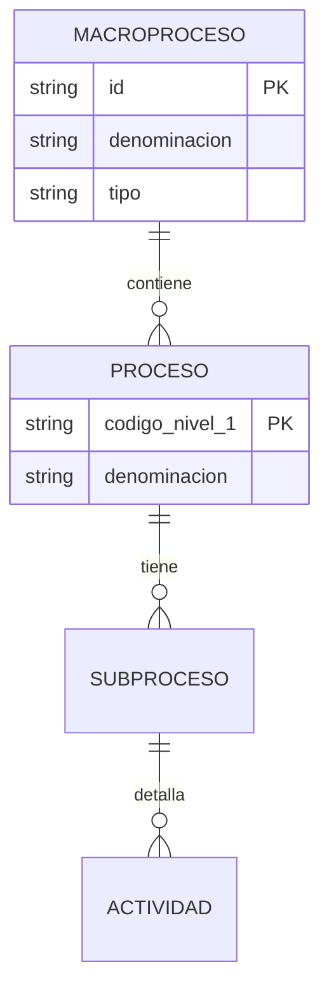

# Diccionario de Datos Institucional

## 1. Estructura del Archivo Maestro (`inventario_maestro.json`)
El sistema utiliza una estructura de objeto raíz con dos colecciones principales:

### A. `mapa_nivel_0`
Define los Macroprocesos raíz que sirven de anclaje para la jerarquía.
| Campo | Tipo | Descripción |
| :--- | :--- | :--- |
| `id` | String | Código único (E.XX, M.XX, S.XX). |
| `denominacion` | String | Nombre oficial del macroproceso. |
| `tipo` | Enum | Estratégico, Misional o Soporte. |

### B. `inventario_maestro`
Colección de subprocesos y actividades. Estructura plana con herencia de claves.
| Campo | Tipo | Descripción |
| :--- | :--- | :--- |
| `codigo_nivel_0` | String | Código del macroproceso padre. |
| `codigo_nivel_1` | String | Código de proceso (Nivel 1). |
| `denominacion_nivel_1`| String | Nombre del proceso. |
| `codigo_nivel_2` | String | Código de subproceso (Nivel 2). |
| ... | ... | Hasta Nivel 4. |

## 2. Definición Técnico-Funcional
- **Estandarización de Códigos:** Todos los códigos deben seguir el regex `/^[E|M|S]\.\d{2}/`.
- **Sanitización:** No se permiten etiquetas HTML ni caracteres `<` `>` dentro de las denominaciones para evitar ataques XSS.
- **Normalización Inteligente:** El sistema mapea automáticamente sinónimos como "Nombre Nivel 0" a "denominacion_nivel_0" durante la ingesta.

## 3. Diagrama Entidad-Relación (Mermaid)

