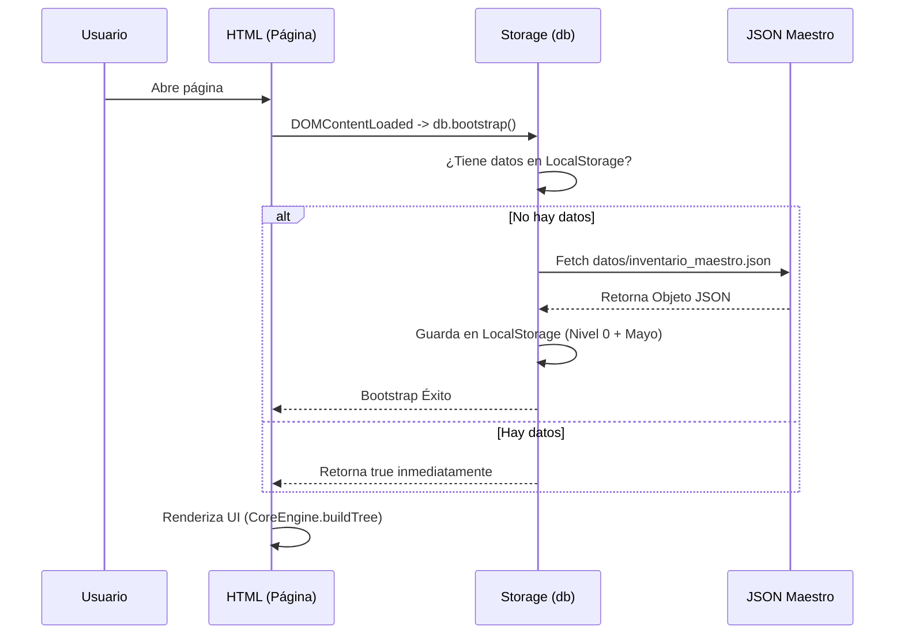
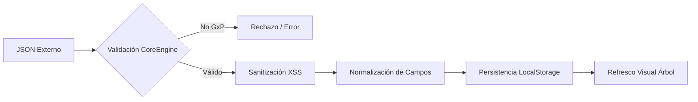

# Flujos de Eventos y Secuencias Técnicas

## 1. Ciclo de Vida del Aplicativo (Bootstrap)
Describe el proceso que ocurre cada vez que el usuario abre cualquier página del sistema.

## 2. Flujo de Inyección de Datos (Batch Injection)
Describe el proceso de validación y limpieza durante la carga masiva.

## 3. Generación de Estructura Local (ZIP)
Describe cómo se transforma el inventario en un archivo descargable.
1. **Trigger:** Usuario pulsa "Descargar Estructura Local (.zip)".
2. **Reconstrucción:** El `CoreEngine` construye el objeto jerárquico recursivo.
3. **Compresión:** `JSZip` itera por cada nivel creando carpetas virtuales.
4. **Exportación:** Se inyecta un archivo `INFO.txt` en cada nodo hoja para evitar carpetas vacías y se sirve el Blob al navegador.
