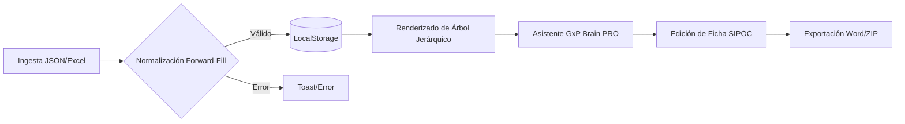

# Flujos y Eventos: AGROIDEAS GxP

## 🔄 Diagramas de Flujo de Procesos
El flujo principal describe el viaje del dato desde su origen heterogéneo hasta su salida como documento normativo e institucional.

## 🧬 Ciclo de Vida de los Datos
El sistema transforma datos crudos en activos de conocimiento institucional siguiendo este ciclo:
1.  **Captura (Ingesta):** Lectura del archivo semilla `inventario_maestro.json` o inyección manual vía `admin.injectBatch`.
2.  **Tratamiento (CoreEngine):**
    *   **Normalización:** Aplicación de la lógica **Forward-Fill** para heredar jerarquías perdidas.
    *   **Sanitización:** Limpieza automática de etiquetas maliciosas (XSS) y caracteres especiales.
3.  **Persistencia (Storage):** Almacenamiento serializado en el navegador con mecanismos de deduplicación por *fingerprint*.
4.  **Explotación (UI/Export):** Mapeo de objetos JSON hacia la interfaz visual (acordeones) y transformación a XML/OpenXML para documentos Word.

## ⚡ Lógica de Eventos y Procesos en Segundo Plano
*   **Gestión Asíncrona:** El sistema utiliza Promesas y `async/await` para no bloquear el hilo principal durante:
    *   **Consultas de IA:** Las llamadas a Gemini o LM Studio se ejecutan en segundo plano, permitiendo al usuario seguir navegando.
    *   **Compresión ZIP:** El empaquetado de estructuras de directorios de Nivel 0 a 4 se realiza de forma asíncrona mediante `JSZip`.
*   **Triggers de UI:** Eventos de tipo `custom` o de sincronización manual (`syncWithMaster`) que disparan el re-renderizado total de los componentes sin recargar la página.

## 📡 Endpoints / Comunicación Interna
Al ser una arquitectura **Local-First**, la "API" es un contrato de comunicación interna entre módulos JavaScript:
*   **Capa de Datos (`storage.js`):** `db.get(key)`, `db.save(key, data)`, `db.exportFullDatabase()`.
*   **Capa de Negocio (`core-engine.js`):** `core.buildTree()`, `core.saveFicha(code, data)`.
*   **Capa de Inteligencia (`ai-handler.js`):** `getAICompletion(prompt, isTechnical)`.
*   **Capa de Salida (`export-engine.js`):** `exporter.toWord(fichaData)`, `exporter.toZip(treeData)`.
